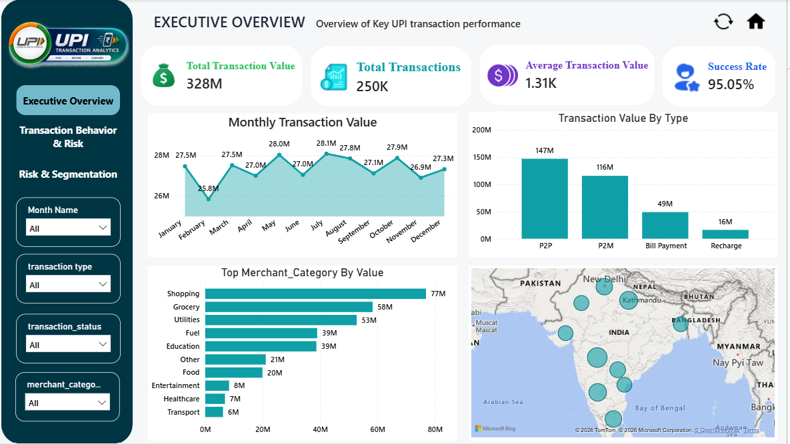
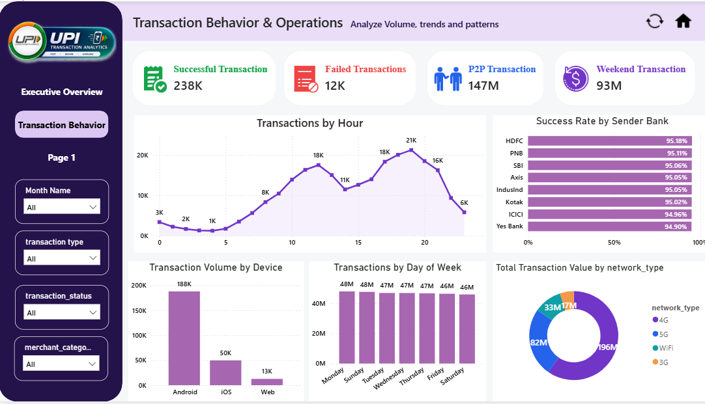

# 💳 UPI Transaction Analysis Dashboard

> An interactive Power BI dashboard for analyzing UPI transaction performance, transaction trends, payment behavior, operational patterns, device usage, network usage, and state-wise transaction activity.

---

## 🖼️ Dashboard Preview

### Executive Overview

### Transaction Behavior & Operations

---

## 📌 Project Overview

UPI Transaction Analysis Dashboard is an interactive Power BI analytics project built to analyze UPI transaction data and transform it into meaningful business insights.

The dashboard focuses on understanding:

- How many UPI transactions are processed
- What is the total transaction value
- How transaction success and failure rates change
- How transaction value varies by transaction type
- Which merchant categories contribute the most transaction value
- Which states generate higher transaction value
- When transactions are most active during the day
- Which devices and network types are commonly used
- How transaction success rates vary across sender banks
- How transaction activity differs between weekdays and weekends

The final dashboard contains **2 analytical pages** connected through interactive navigation.

---

## 🎯 Project Objectives

The main objectives of this project are to:

1. Monitor overall UPI transaction performance.
2. Analyze transaction value and transaction volume.
3. Measure successful and failed transactions.
4. Identify transaction trends over time.
5. Compare transaction types and merchant categories.
6. Analyze state-wise transaction activity.
7. Understand transaction behavior by hour and day.
8. Analyze device and network usage.
9. Compare success rates across sender banks.
10. Present insights through a clean and interactive Power BI dashboard.

---

## 🧰 Tools & Technologies

| Tool / Technology | Purpose |
|---|---|
| Microsoft Power BI | Dashboard development and interactive reporting |
| Power Query | Data cleaning and transformation |
| DAX | Measures, KPIs and analytical calculations |
| CSV Dataset | Source transaction data |
| Power BI Visuals | Charts, cards, map, slicers and navigation |

---

# 🖥️ Dashboard Structure

The dashboard is organized into two analytical pages:

### 1. 📊 Executive Overview

Provides a high-level summary of UPI transaction performance.

### 2. ⚙️ Transaction Behavior & Operations

Focuses on transaction timing, operational behavior, device usage, network usage and sender-bank success rates.

---

# 📊 1. Executive Overview

The Executive Overview provides a quick summary of the overall UPI transaction performance.

## KPI Cards

| KPI | Value |
|---|---:|
| Total Transactions | 250K |
| Total Transaction Value | ₹328M |
| Success Rate | 95.05% |
| Average Transaction Value | ₹1.31K |

---

## 📈 Monthly Transaction Value

Shows how total UPI transaction value changes month by month during 2024.

This visual helps identify monthly transaction patterns and changes in transaction activity.

---

## 💳 Transaction Value by Type

Compares transaction value across different transaction types such as:

- P2P
- P2M

This helps understand how transaction value is distributed across transaction types.

---

## 🛍️ Top Merchant Categories by Value

Shows merchant categories based on their transaction value.

The visual helps identify categories contributing higher transaction value.

---

## 🗺️ Transaction Value by State

A map visual displays transaction value across sender states.

This provides a geographical view of UPI transaction activity.

---

## 💡 Business Questions Answered

- How many UPI transactions were recorded?
- What is the total transaction value?
- What percentage of transactions were successful?
- What is the average transaction value?
- How does transaction value change month to month?
- Which transaction type contributes the highest value?
- Which merchant categories have higher transaction value?
- Which states generate higher transaction value?

---

# ⚙️ 2. Transaction Behavior & Operations

This page focuses on understanding **when, how, and through which channels transactions are happening**.

## KPI Cards

| KPI | Value |
|---|---:|
| Successful Transactions | 238K |
| Failed Transactions | 12K |
| P2P Transaction Value | ₹147M |
| Weekend Transaction Value | ₹93M |

---

## ⏰ Transactions by Hour

A line chart shows transaction activity across different hours of the day.

This helps identify periods with higher transaction activity and understand daily transaction behavior.

---

## 🏦 Success Rate by Sender Bank

Compares transaction success rates across sender banks.

This visual helps identify differences in transaction success performance between banks.

---

## 📱 Transaction Volume by Device

Shows transaction volume across different device types.

Examples include:

- Android
- iOS
- Web

This helps understand the devices commonly used for UPI transactions.

---

## 📅 Transactions by Day of Week

Shows transaction volume across the days of the week.

This helps compare transaction activity between different weekdays and weekends.

---

## 📶 Transaction Volume by Network Type

Shows transaction volume based on network type.

Examples include:

- 4G
- 5G
- Wi-Fi

This provides an overview of the network environments used for UPI transactions.

---

## 💡 Business Questions Answered

- When are UPI transactions most active?
- How many transactions are successful and failed?
- Which sender banks have higher success rates?
- Which devices are commonly used for transactions?
- Which days have higher transaction activity?
- Which network types are commonly used?
- What is the P2P transaction value?
- What is the weekend transaction value?

---

# 📊 Key Project Metrics

Based on the 2024 transaction dataset:

- **250,000** total transactions
- **₹327.94M** total transaction value
- **237,624** successful transactions
- **12,376** failed transactions
- **95.05%** overall success rate
- **₹1,312** average transaction value
- **₹147.15M** P2P transaction value
- **₹93M** weekend transaction value

---

# 🔄 Data Preparation

The dataset was prepared using Power Query before creating the dashboard.

### Data preparation activities included:

- Data type validation
- Timestamp/date handling
- Transaction field validation
- Date extraction
- Month and month-number creation
- Data transformation
- Data modeling
- Creation of calculated measures using DAX

A separate Date Table was also created for time-based analysis.

---

## 🎨 Dashboard Design

The dashboard uses a clean business-oriented design with:

- KPI cards
- Interactive charts
- Map visualization
- Slicers
- Page navigation
- Consistent color palette
- Interactive filtering
- Clean dashboard layout

The dashboard uses a **purple, blue, teal and orange** visual theme for the Transaction Behavior & Operations page.

---

## 🧭 Dashboard Navigation

The dashboard contains two analytical pages with simple navigation:

### 📊 Executive Overview

Provides a high-level view of overall UPI transaction performance.

### ⚙️ Transaction Behavior & Operations

Provides detailed insights into transaction behavior and operational patterns.

A **Home button** and **page navigation buttons** are used to move between the dashboard pages easily.

---

## 🛠️ Skills Demonstrated

**Power BI | DAX | Power Query | Data Cleaning | Data Modeling | Data Visualization | KPI Development | Business Analysis**

---

## 🏁 Conclusion

The UPI Transaction Analysis Dashboard transforms raw UPI transaction data into an interactive and easy-to-understand Power BI report.

The project provides insights into **transaction performance, transaction value, transaction behavior, state-wise activity, device usage, network usage, and transaction success rates**.

This project demonstrates practical skills in **Power BI, DAX, Power Query, data cleaning, data modeling, visualization, and business analysis**.

---

